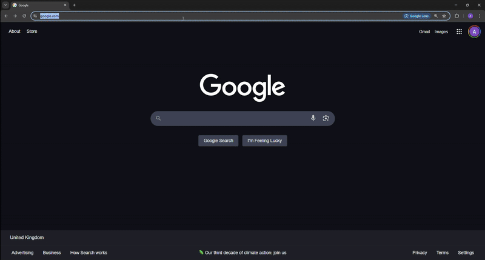

<h1 align="center">


[![CI][s0]][l0] [![UNSAFE][s3]][l3] [![dep_status][s7]][l7] 
</h1>

[s0]: https://github.com/AlexTrebs/Shortcuts/workflows/CI/badge.svg
[l0]: https://github.com/AlexTrebs/Shortcuts/actions
[s3]: https://img.shields.io/badge/unsafe-forbidden-success.svg
[l3]: https://github.com/rust-secure-code/safety-dance/
[s7]: https://deps.rs/repo/github/AlexTrebs/Shortcuts/status.svg
[l7]: https://deps.rs/repo/github/AlexTrebs/Shortcuts

<h5 align="center">A fast, simple, browser shortcut tool.</h1>



## <a name="table-of-contents"></a> Table of Contents

1. [Pre-Requisites](#prereq)
2. [Installation](#install)
3. [Build](#build)
4. [Setup](#setup)
5. [Architecture](#arch)
6. [Config](#config)
7. [FAQ's](#faqs)

### 1. <a name="prereq"></a> Pre-Requisites <small><sup>[Top ▲](#table-of-contents)</sup></small>

For this project to run you will require the following:
- Rust & Cargo installed (https://www.rust-lang.org/tools/install)
- pnpm installed (https://pnpm.io/installation)
- SQLite3 installed (https://sqlite.org/download.html)
- [optional] make installed (https://www.gnu.org/software/make/)

### 2. <a name="install"></a> Installation <small><sup>[Top ▲](#table-of-contents)</sup></small>

This project is build with Cargo, pnpm, and SQLx-cli.

If make was installed, these steps can be skipped with:     <sup float="right">[Skip ▼](#build)</sup>

```sh
make setup
```


To setup the repository install the rust dependencies with: 

```sh
cargo install
cargo binstall cargo-watch
cargo binstall sqlx-cli
```

Next install the pnpm dependencies with:
```sh
pnpm install
```

Finally you will need to create and migrate the db with:
```sh 
sqlx db create
sqlx migrate run
```
or using the bash script:
```sh
./migrations.sh
```

Now you should be ready to build and run the project.

### 3. <a name="build"></a> Build <small><sup>[Top ▲](#table-of-contents)</sup></small>

The build process is quite simple.

First run:

```sh
make tailwind
```
or
```sh
npx @tailwindcss/cli -i ./ui/styles/tailwind.css -o ./ui/assets/main.css
```

This is required to setup the css styling over the project. 

Following that run:

```sh
make server-watch
```
or 
```sh
RUST_LOG=info cargo watch -x run
```
This will start the rust server up. Once built, you can access the app at: http://localhost:3000, or your configured port.

## 4. <a name="setup"></a> Setup <small><sup>[Top ▲](#table-of-contents)</sup></small>

Following this you will need to set up a shortcut for your search bar. Given you have not changed the port, the steps for some common browsers are as follows:

#### <b><u>Google Chrome/Chromium:</u></b>
1. Go to chrome://settings/search. 
2. Click "Manage search engines and site search". 
3. Click "Add" next to "Site search". 
4. Fill the url to be `http://localhost:3000/api/get?keyword=%s`
5. Fill out the rest of the details and save.

#### <b><u>Mozilla Firefox:</u></b>
1. Go to about:preferences#search. 
2. Click "Search Shortcuts". 
3. Click "Add". 
4. Fill the url to be `http://localhost:3000/api/get?keyword=%s`
5. Fill out the rest of the details and save.

#### <b><u>Microsoft Edge:</u></b>
1. Go to edge://settings/searchEngines?search=address. 
2. Click "Add" next to "Site search". 
3. Fill the url to be `http://localhost:3000/api/get?keyword=%s`
4. Fill out the rest of the details and save.
 
#### <b><u>Brave:</u></b>
1. Go to brave://settings/search. 
2. Click "Manage search engines and site search". 
3. Click "Add" next to "Site search". 
4. Fill the url to be `http://localhost:3000/api/get?keyword=%s`
5. Fill out the rest of the details and save.

#### <b><u>Vivaldi:</u></b>
1. Go to vivaldi://settings/search. 
2. Click "Search Engines". 
3. Click "Add" next to "Site search". 
4. Fill the url to be `http://localhost:3000/api/get?keyword=%s`
5. Fill out the rest of the details and save.

## 5. <a name="arch"></a> Architecture <small><sup>[Top ▲](#table-of-contents)</sup></small>

This project is a Rust HTMX monolith applications.

[HTMX](https://htmx.org) is a lightweight HTML templating structure, that allows you to to swap elements in the DOM with api responses.

For the templating system, we are using [Tera](https://docs.rs/tera/latest/tera/), which uses Jinga inspired templates.

With Tera, we have chose to use the [tera-hot-reload](https://github.com/oxidlabs/tera-hot-reload) crate. This allows for quick and easy development of the ui.
 
Roulghy a page template can be describe similar as below:

```rust
#[derive(TeraTemplate, Serialize)]
#[template(path = "template.html")]
pub struct Template {
  pub title: String
}

pub fn getTemplate(tera: Tera) {
  let context = Template { title: "template" }

  return Html(self.render(tera));
}
```

Where an example template.html can be: 

```html

 
{{ title }}
 

<main class="ml-14 pl-5 flex-1 p-4 dark:bg-neutral-800" style="justify-items: center;" >
  <div id="load-error" class="dark:text-white"></div>
  
  <div id="results" \>
</main>

```

With api calls we can then set the results div as out output of a function.

More examples of this can be seen in: 
- [HTMX templates directory](ui/templates)
- [Rust templates directory](src/templates)
- [Routes](src/routes/shortcut.rs)
- [Service](src/service/shortcut.rs)

The interaction between our server and our database is using [sqlx](https://docs.rs/sqlx/latest/sqlx/).

In an ideal world, I would use [sqlean](https://github.com/nalgeon/sqlean), [spellfix1](https://sqlite.org/spellfix1.html) extension, or [elastic-rs](https://github.com/elastic/elasticsearch-rs?tab=readme-ov-file) to allow fuzzysearching within the database. 

But for simplicities sake, we are currently using a [SQLite](https://sqlite.org) database without any extensions.

This means for our searches, it will require pulling the entired shortcut database, and searching/sorting within the Rust layer which is not as bad as you think due to Rust's fast nature.

Finally, we use [tailwind](https://tailwindcss.com) for our component styling.

## 6. <a name="config"></a> Config <small><sup>[Top ▲](#table-of-contents)</sup></small>

All the config is kept within the `.env` file.

The default is:

```sh
DATABASE_FILENAME=shortcuts.db
DATABASE_URL=sqlite://${DATABASE_FILENAME}?mode=rwc
PORT=3000
UI_URL=http://localhost:${PORT}
```

## 7. <a name="faqs"></a> FAQ's <small><sup>[Top ▲](#table-of-contents)</sup></small>

Feel free to create anny issues at: https://github.com/AlexTrebs/shortcut/issues
